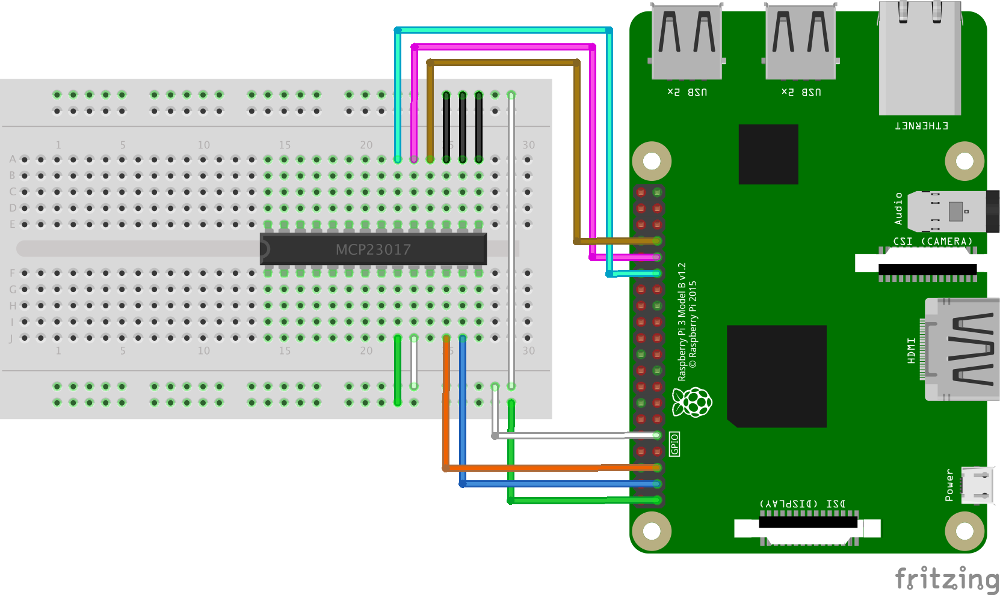

# Microchip 8/16-bit I/O Expander

Microchip's 8bit and 16bit wide gpio expander provides the ability to offload gpio to dedicated chip via i2c or spi interface.

This implmentation sports several feature not found elsewere (js or otherwise). Providing direct access to the full
feautre set of the chip.

Such as:
 - Optional Gpio application extention
 - Smart Mode (bank/sequential) Sniffing
 - Support multiple access modes (`8bit-poll`, `16bit-poll`, `dual-blocks`, `interlaced-block`)
 - Dual / Single and Poll interrupt support
 - Pull-up resistor state access
 - Output and Output Latch access
 - Gpio / Byte / Word interface (with access optimizations)
 - Burst read / write
 - Dynamic Pin naming schemes
 - I2C and SPI generic interface (beta)
 - 8-bit version support (beta - missing proper iocon register setup)
 - Detailed profile configuration (slew, hardward address, etc.)

### Models

The Microchip MCP23 line covvers five variation across two bus types split into single and dual port chips.

Each chip is labled MCP23BVV, where:

B is for bus ( "0" for I²C / "S" for SPI ).

VV, the version, is listed following table:

| 8-bit | 16-bit | Note |
| -- | -- | -- |
|      | "16" | Odd registers; limited modes; IAR |
| "08" | "17" | Common in the wild |
| "09" | "18" | Includes INTCC feature |

This pairing of 8 and 16-bit chips by feature shows the evolution of the mcp23 line over time. For example the mcp23009 and mcp23018 share the feature sets of their previous version as well as the (INTCC register) ability to contorl if a read from the GPIO or INTCAP register triggers clearing of the interrupt, as oppossed to the older mcp23008 and mcp23017 which triggered a interrupt clear on either register.

### Obligatory fritzing


An example mcp23017 wired to pi. with pin 5 and 6 wired as open-darin INT A and B, as well as pin 13 reset. Address pin are grounded for default address.

### API

While most consumers will want an application layer interface to this chip (`Mcp23Gpio` or others) the device level interface also available.

Architecturally the bus and byte level abstraction (via a memory map and mode specific register layouts) is handled by the `Common` classes.   As these `Common` class "speak" buffer the `Converter` class is used in the `Mcp23` (and friends) class implmenetations that are built ontop of `Common`.

While generaly any code above `Common` is considered part of an application specific logic, the `Mcp23base` provides basic usefull data conversions, and `Mcp23cached` simplifies managing `mode`.  Both of these are provided via the exported `Mcp23` extention class.

As such the `Mcp23Gpio` class that extends `Mcp23Cached` and uses `Common` directly is a perfect example of a use case specific application - and while the above can be justified as part of the core package, this may be moved out eventually.

##### `Common`
 - `state()`
 - `exportAll()`
 - `bulkData()`
 - `readPort()`
 - `writePort()`
 - `readAB()`

##### `Mcp23` extends `Mcp23Cached` extends `Mcp23base`
 - `from()`
 - `mode` (getter / setter for cached mode)
 - `setProfile()`
 - `profile()`
 - `state()`
 - `exportAll()`
 - `bulkData()`

##### `Mcp23Gpio`
 - 
##### `Gpio`
 - 

### Example

Create a new instance using `from`

```javascript
  bus.init(...)
    .then(bus => Mcp23.from(bus))
    .then(client => {
      ...
    })
    .catch(e => ...)
```

### Interrupts (from the chips mcp perspective - aka INTA and INTB handlers)

The library assume external resources for providing interrupt callbacks into the library.  

A common package like `onoff` can be used to capture the interrupts (via efficiant `.watch` methods).  Though, no specific dependency exists.  

Software interrupts can also be achived, at the cost of polling this chip (with some efficiency via the interrupt flags register).

Take care when assuming startup configuration, as the chips INTA and INTB can be configured in a variety of ways (`open-drain`, mirror enabled, etc).  Other condition exist if using mcp23 lib directly (aka, not the gpio application) on when and what order individual pins are configured, and thus, when and what conditions INTA and INTB can be triggered.

### Bus (i2c / spi)

Similar to gpio for interrupts, the library only assumes a common interface for bus implementations.  This is currently tied to the API used in `@johntalton/rasbus` wrapper package.  

`i2c-bus` is well tested.

### Pins / Ports / Word up

The expander can be accessed in multiple use cases, by pin, port or full word, and multiple interrupt can be configured 
to drive specific use cases.  Further use of banking can optimize use case interactions and provide performance increases.

Pins and Ports can be mixed as long as they do not overlap. Word requires the entire 16-bit chip and thus is exclusive.

##### Pins

The chip provides 16 individual gpio pins.  These can be used directly as singular pins and interacted with in a similar
way to sysfs interactions (see `onoff`).

Addressing of the pins can be mapped though commonly referenced as [0, 1, ... 15] or ['A0' ... 'A7', 'B0' ... 'B7'].
Though this map can be augmented to support custom names (useful when multiple mcp23 chips are used to keep one sane)

##### Port A/B

The chip is naturally split into two 8-bit ports. Referenced as `A` and `B` and specifically labeled in the specs (aka see doc for wiring etc).

This interface provides a `readUInt8`/`readInt8` methods to allow for a more natural interaction.  This also attempts to optimize the chip interaction where possible.

Depending on overall configuration, Port A and B can utilize independent Interrupts to further prioritize interactions

And will a Port can be using independently, or with other single Pins, it can be a common use case to allocate a read-port and a write-port and use interrupt to drive transformation.

##### Word

Full 16-bit word write.  This is for the most part a wrapper around the combined PortAB and creating the higher level access method: `readUInt16LE`, `readUInt16BE`, `readInt16LE`, `readInt16BE`.


### Mode

Four mode of access are supported:
 - `8bit-poll`
 - `16bit-poll`
 - `dual-blocks`
 - `interlaced-block`

These are the permutations of the register memory layout (aka `BANK`) and if the chips auto-increment is enabled (aka `sequential`).

As such for the `8bit-poll` and `16bit-poll` successive non-address reads or write (ie i2cbus.write(Buffer)) would return the same 8 or 16 bit register.  This is usefull for impmenenting, among other features, a fast poll on the interrupt flags register in order to create a software interrupt in place of INTA and INTB when they are not avaialble.

`dual-blocks` and `interlaced-block` can be usefull when doing bulk operations (like full `exportAll` or `profile`).

Using `dual-block` could allow for optimized writes or reconfigurations to a single port (A or B) while minimizing distrubtive or unneccesary register reads / writes.

The default mode is `interlaced-block`, providing a common flexible mode.  It allow for reading 16bit words in single calls, and also allowing for block reads of those words.  This can be used as a compromise mode between 16bit poll and bulk access.   

Setting the chips profile (via `setProfile`) can update the chips access mode. As the datasheet notes, the mode changes as soon as the profile (IOCON register) is writen.  While the `Mcp23` api exposed does attempt to cache the mode correclty on read and writes, impmementors should be aware of the behavior and result it may have on other code that assume or does not share the mode cache (the Transaction api which can lock / watch mode provides a path to address some of these issue).

While the chips defaults to `interlaced-block` on power-on-reset (aka on power up), and is the most common operational mode, the nature of the api needs to assume correctly the current mode prior to other actions (including `setProfile` - which is used to change the mode and even `profile` may fail if bank is assumed incorrectly [or worse, not fail and update incorrect register]).  Thus, `.mode` is expossed on the `Mcp23` api which can be pre-set to the mode value prior to other actions (it makes no bus calls, it just updates this instances cache of expected mode value [assming use of the high level cached mode version of the api]).

Give this complexity, this library also offers the `sniffBank` method as follows:

#### Sniff Mode

Calling `sniffMode` will attempt to safely access the bus and registers, assuming this may not be a Mcp23 chip, and / or the mode may not be assumed correctly.

It does this by reading several addressing and probing state to attempt to guess the correct bank.

```javascript
  ...
  client.sniffMode().then(guess => {
    console.log('smells like', guess);
  })
```

This lead to the option of non-distructive reads of the chips configuration (`profile` / `status`) after program / or MCP restart but not chip reset.  The included example client uses this methodology to validate chip configuration upon start to avoid aditional register updates (configurable via its json).  

### Dynamic naming

Naming in the first pain of all developers, and as such the library can be initialized with custom name maps.
Name map descripe the port and pin layout.

Three common layouts are included
 - gpio16
 - port names
 - pysical names

While using the existing constant `PHYSICAL_NAME` this example shows how to init with a custom map.

```javascript
   ...
    .then(bus => Mcp23.from(bus, {
      portA: { name: 'A', gpios: [21, 22, 23, 24, 25, 26, 27, 28] },
      portB: { name: 'B', gpios: [1, 2, 3, 4, 5, 6, 7] }
    }))
    .then(device => {
      ...
      const button = device.exportGpio(21, ...)
    })
    
```

The `DEFAULT_NAMES` constant is an alias for `GPIO16_NAMES` (which lists the names a 0 .. 15).
Note that `gpios` array values must be globaly unique to the chip (aka you can not have 0..7 and 0..7 on each port, 
`PORT_NAME` constant solves this by scoping A0..A7, B0..B7).

Custom maps can use a mix of types (such as "led" etc) as long as they are unique and equitable (aka `===`)

### Burst Read / Write

Because this chip support simplified access to repeat register writes (like `8bit-poll` mode) this library can support a buffered read and write that can be streamed to the chip via native bus support.

This not only provides a efficient way to poll (read) but also potentialy provides a high enough output performance to support unique applications not able to be provided by tradition gpio, and /or other implementaitons of mcp23 libraries.

### SysFS (device tree overlay)

Existing device tree overlays exist for the mcp23x17 chip and expose the default `/sys/class/gpio` interface. 
And can be accessed via libs like `onoff`.

 - overlay works mostly - have run into some issues with the code
 - requires system mod - require permissions to modify boot config / not portable across generic platform
 - does not expos some advanced features - bank access, fast poll, multiple A/B Interrupts, etc.
 
 ### Refs
 
Amongst the typical [goto](https://github.com/adafruit/Adafruit-MCP23017-Arduino-Library) source of implementations for these types of things, the [pin control](https://git.kernel.org/pub/scm/linux/kernel/git/torvalds/linux.git/tree/drivers/pinctrl/pinctrl-mcp23s08.c) in the linux kernel is descriptive.  Along with [wiringPi](https://git.drogon.net/?p=wiringPi;a=blob;f=wiringPi/mcp23017.c;h=4c3952d268751a3347a35ee3daffc3a7038d191b;hb=HEAD) version.  And a javascript alternative [johnny-five](https://github.com/rwaldron/johnny-five/blob/master/lib/expander.js)

